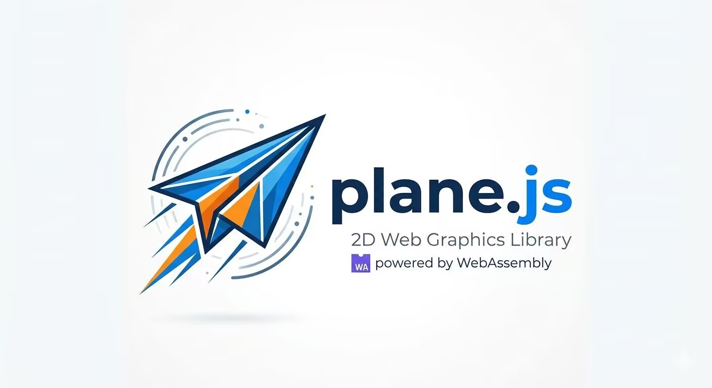

# Plane.js

## 项目概述

Plane.js 是一款轻量级的 JavaScript 2D 游戏引擎，采用节点树（Scene Tree）架构设计，支持场景管理、渲染、物理、动画、音视频等游戏开发核心功能。

## 技术特性

### 核心模块

| 模块 | 描述 |
|------|------|
| **核心 (core)** | 包含 Engine、Node、SceneTree、EventBus、MainLoop 等基础架构 |
| **数学 (math)** | 提供 Vector2、Rect2、Transform2D、Color、MathUtils 等数学工具 |
| **节点 (nodes)** | 支持 Node2D、Sprite、AnimatedSprite、Label、ColorRect、TextureRect、Container、TileMap、Particle2D 等游戏对象 |
| **物理 (physics)** | RigidBody2D 刚体物理系统 |
| **渲染 (renderer)** | Canvas 2D 渲染管线 |
| **动画 (animation)** | 动画系统支持 |
| **音频 (audio)** | AudioStreamPlayer 音频播放器 |
| **输入 (input)** | Input 输入管理系统 |
| **资源 (resources)** | ResourceLoader 资源加载器 |
| **UI (ui)** | Control UI控件系统 |
| **相机 (camera)** | Camera2D 2D相机 |
| **组件 (components)** | SpriteRenderer 等组件系统 |

### 技术亮点

- **Scene Tree 架构**：基于树形结构的场景管理系统
- **WASM 加速**：可选的 WebAssembly 数学计算支持（wasm/plane_math）
- **信号系统**：EventBus 事件总线实现节点间通信
- **物理引擎**：集成 RigidBody2D 刚体物理
- **多节点类型**：涵盖精灵、粒子、地图、容器等多种游戏对象

- **开发团队**：HGSpace

详细代码查看其他分支
